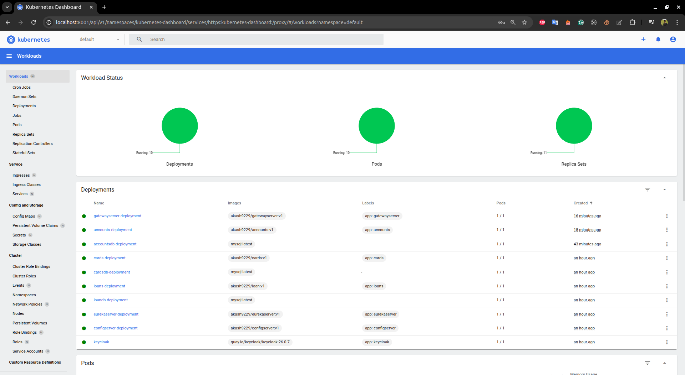

# Kubernetes Dashboard

This image shows the Kubernetes Dashboard with deployed microservices.




# Kubernetes Dashboard Documentation

[K8s Dashboard Documentation](https://kubernetes.io/docs/tasks/access-application-cluster/web-ui-dashboard/)

## Helm Installation
[Helm Installation Guide](https://helm.sh/docs/intro/install/)

## Dashboard Installation
```sh
helm upgrade --install kubernetes-dashboard kubernetes-dashboard/kubernetes-dashboard --create-namespace --namespace kubernetes-dashboard
```

## Port Forwarding for Dashboard Access
```sh
kubectl -n kubernetes-dashboard port-forward svc/kubernetes-dashboard-kong-proxy 8443:443
```

## Create Dashboard Admin User
```sh
kubectl apply -f dashboard-adminuser.yaml
```

## Role Binding for Admin User
```sh
kubectl apply -f dashboard-rolebinding.yaml
```

## Create Secret for Admin User
```sh
kubectl apply -f secret.yml
```

## Create Token for Admin User
```sh
kubectl -n kubernetes-dashboard create token admin-user
```

## Create Bearer Token for Access by a Single Token
```sh
kubectl get secret admin-user -n kubernetes-dashboard -o jsonpath="{.data.token}" | base64 -d
```

## Kubernetes Commands
```sh
kubectl get deployments
```
```sh
kubectl get services
```
```sh
kubectl get replicaset
```
```sh
kubectl get pods
```
```sh
kubectl describe pod <pod-name>
```
```sh
kubectl logs <pod-name>
```
```sh
kubectl get pods -o wide
```

## Create Docker Images from the Git Project

Follow the steps mentioned in this link repository to create Docker images for the this Kubernetes project from the Git repository: [microservice-architecture-java](https://github.com/AkashBhuiyan/microservice-architecture-java).


## Create Environment Variable in Kubernetes Cluster
```sh
kubectl apply -f configmaps.yml
```

## Order of Deployment
To ensure services are deployed in a structured manner, the following order should be followed:

1. **Keycloak** - Identity and access management service.
2. **ConfigMaps** - Configuration for environment variables and other settings.
3. **ConfigServer** - Centralized configuration management service.
4. **EurekaServer** - Service registry for microservices.
5. **accountsdb** - database for microservices.
6. **cardsdb** - database for microservices.
7. **loandb** - database for microservices.
8. **Accounts** - Microservice handling account-related operations.
9. **Loan** - Microservice managing loan-related functionalities.
10. **Cards** - Microservice handling card-related processes.
11. **Gateway** - API Gateway for routing requests to services.

## Deploying Applications in Kubernetes
To deploy microservices and applications in a Kubernetes cluster, the appropriate YAML manifest files should be created and applied. Each microservice and configuration must be properly defined before deployment.

### Deployment Commands
```sh
kubectl apply -f keycloak.yml
```
```sh
kubectl apply -f configserver.yml
```
```sh
kubectl apply -f eurekaserver.yml
```
```sh
kubectl apply -f accountsdb.yml
```
```sh
kubectl apply -f cardsdb.yml
```
```sh
kubectl apply -f loandb.yml
```
```sh
kubectl apply -f accounts.yml
```
```sh
kubectl apply -f loan.yml
```
```sh
kubectl apply -f cards.yml
```
```sh
kubectl apply -f gateway.yml
```

